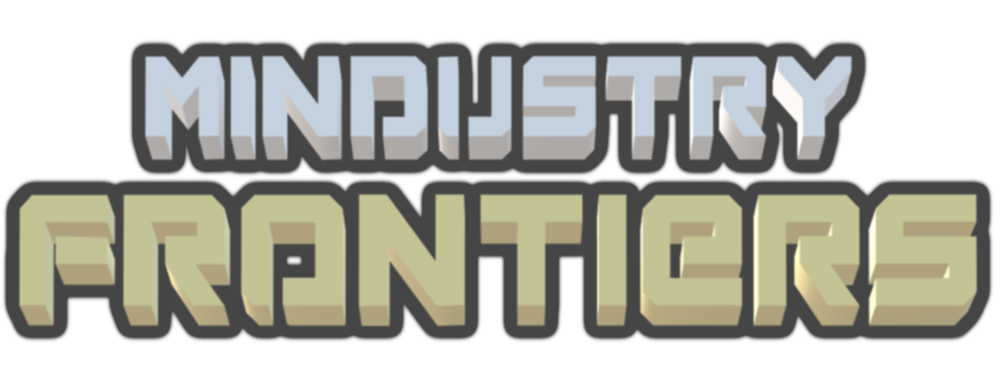

# Not anymore in development

# About
A Mindustry fangame made using Unity and coded in C#. Aiming to give a more cinematic experience with minimal effort from the player
> **Developed** by **Lepisma**, based on **Mindustry** by **Anuken**

# Current progress
The current game includes most of the base mindustry features
To name some: Multiplayer, Map Editor, Units, Blocks, Unit AI, Unit commands, Unit "Voice lines", Item and Fluid transport and production and Turrets

# What to expect
Currently im woring on adding all the base mechanics that are the same as mindustry, to have a base from where to start implementing all the new things

Some of the things planned (not in any specific order):
 - Per-match tech tree: a map dependent tech tree that starts from 0 each match
 - Upgrade system: allows to upgrade units and blocks with upgrades that will change most of the content's parameters, allowing for complex strategies
 - Radar system: similar to the fog of war, but only for entities
 - Stealth units: will show smaller on the radars
 - Finite resources: resources with a limited amount of items that will boost the player and provoque territory disputes
 - High building cost: low amount of blocks will encourage outposts and spread-out bases without choke points
 - Aircraft carriers: a unit with some of the already implemented landingpads on it (This units will be the exception to the big unit rule)
 - Missions: Extract 2000 of "x" resource, Destroy "x" block, Survive "x" time, Rebuild "x" blocks, Escort "x" units
 - Jump stations: FTL travel for calling support units, i will make sure to do things balanced
 - Underground bases: too complex to explain here
 - Trains: with all the variations, turret, payload, landing pad, item cargo, explosive, etc...
 - Rockets: if this goes well, probably a procedural planet exploration system (not impossible, but who knows)

# What not to expect
Content related:
 - Big units: all player produceable units dont go above T3 and wont do, there will be exceptions *(Aircraft carriers)*, but those are already taken into account
 - Big blocks: most blocks will stay below 5x5 except for blocks that their minimum size requires to surpass that, big power generators or runways for example
 - Magic stuff: no, just no, doesnt fit with the realistic style im going towards
 - Nukes: Absolutely no weapon capable of higher destruction than that of a big cannon, if more firepower is needed, apply upgrades, more units or find a better workaround
 - Mod support: there are some code leftovers from a previous mod loading system (that worked), but i wont be redoing it

Gameplay/Mechanics/Other related:
 - Good performance: i expect that a better system will be required compared to mindustry, who wknows by how much
 - Mobile **Input** support: i will make builds for android, but i rather die a hundred times than make touchscreen input support
 - Code readability: live with it

> Everything remains subject to change, and most of the non-planned things could be done with help, but just dont expect me to be doing those
